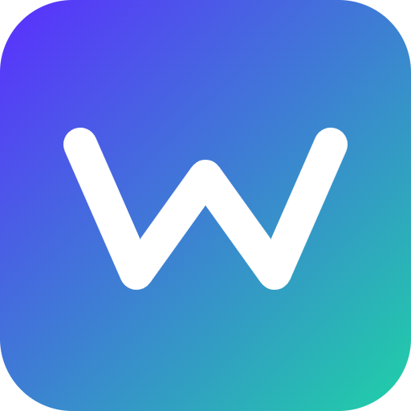

# Wagr


**Social micro-prediction markets for everyday questions among friends**

## Overview

Wagr lets friend groups create instant, tiny prediction markets on anything — sports, local events, trivia — settled transparently on Solana with no bookmaker needed. Groups fund a shared pool, make predictions, and winnings are distributed automatically by smart contract.

## Problem

Casual betting among friends is common but informal, trust-dependent, and hard to settle fairly — especially for ambiguous or subjective outcomes. Someone has to hold the money, someone has to decide who won, and disputes are awkward.

## Solution

A lightweight Solana dapp for creating time-boxed prediction pools with community-voted or oracle-based resolution and automatic payout. No middleman, no bookmaker — just a smart contract holding everyone accountable.

## Features (MVP)

- Create a market in under 30 seconds with stake amount and deadline
- SPL token or SOL staking into a shared escrow pool
- Resolution via group vote or simple oracle integration for sports/crypto prices
- Automatic smart contract payout to winners
- Shareable link/Discord bot integration for group markets

## Tech stack

- Anchor, Rust (Solana program)
- Switchboard oracle (objective outcome resolution)
- Next.js (frontend)
- Discord bot API (in-chat market creation)
- Phantom wallet adapter (wallet connection)

## How it works

```
[Friend Group]
     |
     v
[Next.js App] --create market--> [Anchor Program on Solana]
     |                                   |
     v                                   v
[Phantom Wallet]                 [Escrow PDA holds stakes]
     |                                   |
     v                                   v
[Stake SOL/SPL] --------------> [Resolution: group vote OR Switchboard oracle]
                                          |
                                          v
                                [Smart contract auto-pays winners]
```

1. A user creates a market with a question, stake amount, and deadline.
2. Friends join via a shareable link or Discord bot command and stake into an on-chain escrow pool.
3. When the deadline passes, the outcome is resolved by group vote or a Switchboard oracle feed.
4. The Anchor program automatically distributes the pooled funds to winners — no manual settlement.

## Roadmap

- Add Discord/Telegram bot for in-chat market creation
- Integrate more oracle types for broader market categories
- Explore token-gated private group markets and recurring leagues

## Pitch

- [Pitch deck (PDF)](docs/pitch.pdf)
- [Pitch script](docs/pitch-script.md)

## Team

- Name — Role — [GitHub](#) / [Twitter](#)
- Name — Role — [GitHub](#) / [Twitter](#)
- Name — Role — [GitHub](#) / [Twitter](#)

Built for the Colosseum hackathon.

---

🎬 Pitch video: [docs/pitch-video.mp4](docs/pitch-video.mp4)
